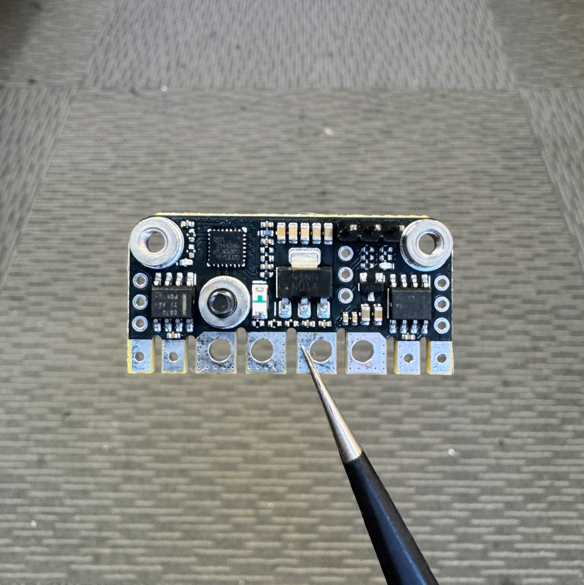
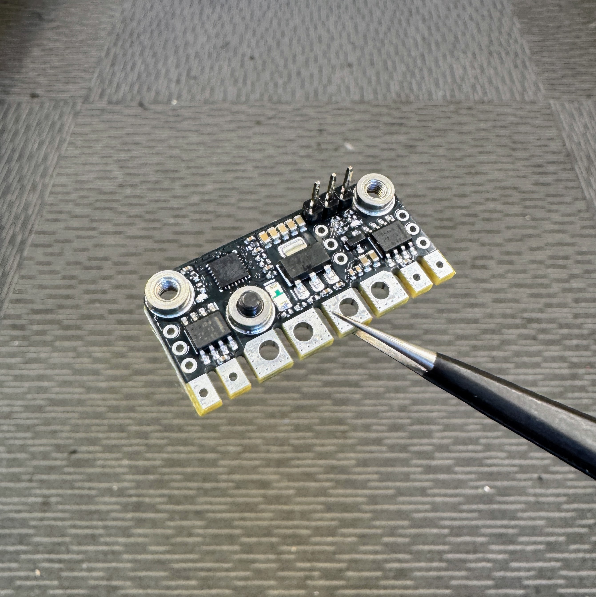
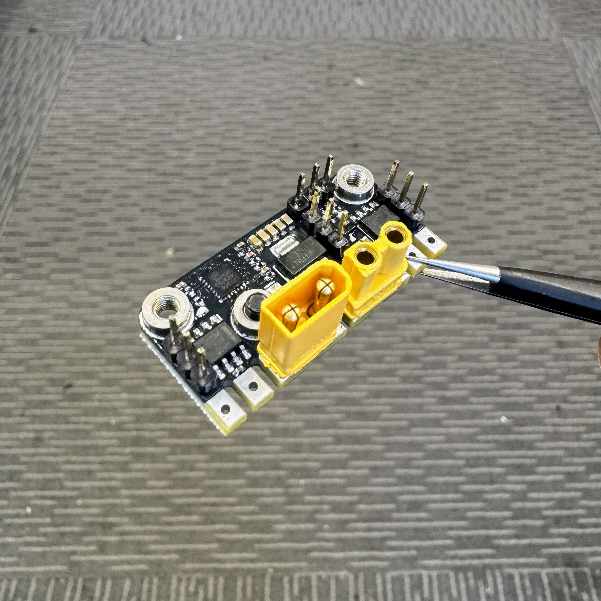
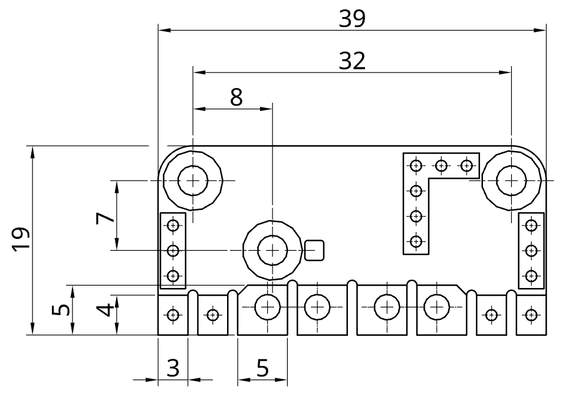
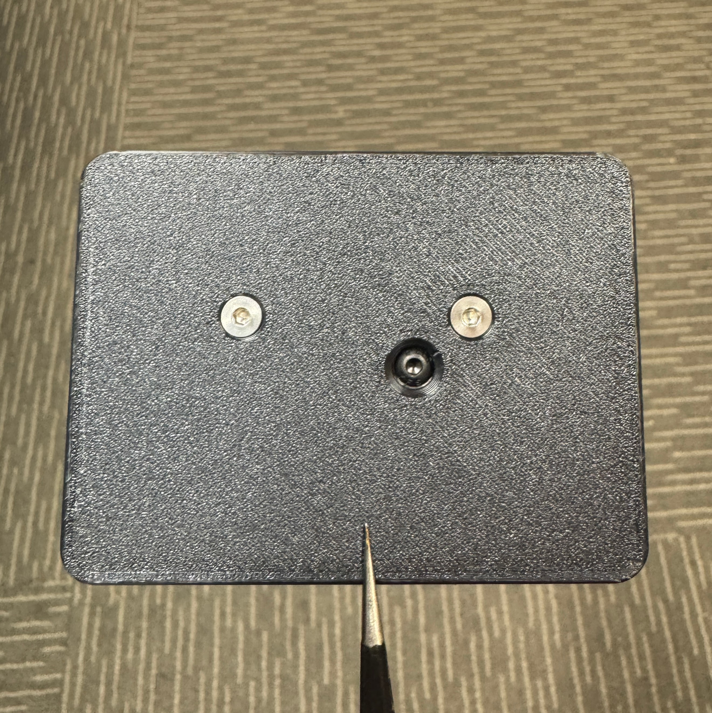

# KAKAPO - 2A v1.2

  

 

The KAKAPO *(ka-kuh-pow)* is a compact, all-in-one control and power platform that's designed to be the heart of your robot, removing setup headaches so you can focus on building and battling. It builds on the proven WEKA dual DC motor architecture, now adding integrated power switching, distribution, and dedicated outputs for light-weight servos or ESCs; streamlining your electronics without compromise.

The product is named after the [Kākāpō](https://en.wikipedia.org/wiki/K%C4%81k%C4%81p%C5%8D), a nocturnal flightless parrot endemic to New Zealand.

Developed, assembled, and tested in [Christchurch, New Zealand](https://www.google.co.nz/maps/place/Christchurch+New+Zealand), by Connor Benton.

## FEATURES

- Dual Bi-Directional DC-motor outputs.
- Dual Servo/ESC signal outputs.
- High-power input that accepts XT30 connector or soldered wire.
- Anti-vibration power switch.
- Switched battery output that accepts XT30 or soldered wire. 
- Power LED aligned with power switch access port.
- Status LED's to indicate run mode, fault and calibration.
- Under-voltage and over-temperature protections.
- Internal BEC to provide power for the radio and low-power auxilary circuits on the servo output connectors.
- Intelligent channel-wise failsafe behaviour.
- Simon-sais calibration process to customise drive modes, channel mapping, and channel inversion.
- Includes a 100nF capacitor across each motor output to filter noise and voltage spikes.
- Integrated M3 threads for mounting.

## SPECIFICATIONS

- **Dimensions:** 39x19x4mm *bare pin-header height* 
- **Weight:** 6g *excluding wires*
- **Voltage Input:** 2-4S LiHV (6-17.4V)
- **Motor Output - Continuious:** 2A  
- **Motor Output - Burst:** 3.6A
- **Radio Input:** Servo PWM, CRSF
- **Servo/ESC Signal Output:** Servo PWM
- **BEC Output:** 5V, 1A. Designed to power your radio and low-power outputs on the servo connector
- **Power Switch Thread:** M3 (2mm Hex Key)
- **Mounting Thread:** M3

## USAGE
### Product Layout - Top

### Product Mounting 

The KAKAPO provides two M3 threaded bosses in each corner to simplify mounting. Shown using an example mount plate below:

 

### Status LEDs

There are 3 LEDs on the KAKAPO (1x red, 2x blue). The red LED is in the center and a blue LEDs are on each edge beside the motor outputs.See table below to detail LED behaviour:

| &nbsp;&nbsp;&nbsp;&nbsp;&nbsp;&nbsp;&nbsp;&nbsp;&nbsp;&nbsp;&nbsp;&nbsp;&nbsp;&nbsp;&nbsp;&nbsp;&nbsp;&nbsp;&nbsp;&nbsp;&nbsp;&nbsp;&nbsp;&nbsp;&nbsp;   State| Red   LED   | Blue   LEDs | | 
| :---:                     | :---:     | :---:     | :--- 
| No Power                  | OFF       | OFF       |  
| Standby                   | ON        | OFF       |         
| Driving                   | ON        | ON        | Each blue LED will immunimate when their corresponding input is being driven. 
| Fault   Signal-Input        | ON        | ALTERNATING FLASH       | 1Hz  
| Fault   Under-Voltage       | ON        | FLASH         | 1Hz
| Fault   Over-Temp    | ON        | FAST FLASH    | 5Hz 
| Calibration               | ON        | PATTERN       | See Calibration section for specific LED patterns
   
### Prototcol Auto-Detection

Each time the KAKAPO powers on, it runs an auto-detect sequence to identify the connected radio protocol. It first tries the last known protocol, then cycles through all supported protocols until a valid signal is found. Once detected, the protocol is saved and the system immediately enters normal operation. If no valid signal is detected, KAKAPO enters a signal-input fault state.

Note: Some receivers take a few seconds to link with the transmitter when powered on. In this case the KAKAPO will enter a signal-input fault state during this time. The fault state will clear automatically once the receiver connects and a valid signal is detected.

### Fault Conditions

KAKAPO continuously monitors for several fault conditions during operation. The monitored faults, listed from highest to lowest priority, are:

1. **Over-Temperature:** An over-temperature fault occurs when the primary sense circuit reaches 100°C. There is also a backup sensor for each motor output that trips at 150°C.

2. **Under-Voltage:** An under-voltage fault occurs if the battery voltage falls below 3.0V (per cell).

    Important note: When KAKAPO powers on, it automatically detects how many cells your battery has to set the appropriate low voltage level. Some battery cell counts have a voltage overlap with adjacent counts, see table below. So, the KAKAPO then assumes the battery is more charged when powering on to solve the overlap. If you start up with a low battery, it might detect and set the undervoltage threshold too low. To avoid issues, we recommend powering on with a fully-charged battery. 

    | Battery Cells | Low Voltage   | High Voltage  | At Risk   | Percentage Overlap |
    | :---:         | :---:         | :---:         | :---:     | :---: |
    | 2s            | 6.0V          | 8.70V         | No        | n/a |
    | 3s            | 9.0V          | 13.05V        | No        | n/a |
    | 4s            | 12.0V         | 17.40V        | Yes       | 19.4% |

3. **Signal-Input:** KAKAPO uses an intelligent failsafe system that monitors each input channel individually. It only triggers a fault if a channel mapped to an output is lost. Here's how the failsafe works:
    1. Only mapped channels matter.
        - Example: If Channels 1, 2, and 3 are mapped to drive/servo outputs, but Channel 4 is unused, losing Channel 4 won’t trigger a fault.
    2. Faults are channel specific: 
        - Example: If only the signal for one servo is lost, just that output stops, everything else keeps running.
        - Example: In arcade drive mode, if the throttle channel is lost, the motors stop driving forward/backward, but turning and servos still work.
    3. The LED will show a signal-input fault whenever one or more mapped channels are lost.
    4. A channel must first be seen (with valid data) before it can be considered "lost":
        - If a mapped channel was never connected at power on, it's not considered a fault. The channel must first be connected then disconnected to be considered a fault. 

    *Note: You should still set the failsafe on the radio reciever to handle a loss of connection between the reciever and transmitter.*

## CALIBRAITON

The KAKAPO has a number of parameters that are detected during the calibration process. These are:

- **Driving Mode:**
    - Tank (Each input channel controls a different motor)
    - Arcade (One input channel controls both motors speed and the second input controls steering) 
- **Motor Braking:**
    - When drive inputs are zero, you can choose if you want the wheels to coast or brake.
- **Input Mapping:**
    - Any input channel can control any output, with the following rules:
        - The two drive inputs cannot be the same channel
        - Neither drive input can map to the servo outputs
        - You can map a single input to both servo outputs 
- **Input Inversion:**
    - Any input channel can be reversed.
    - Eg: No resoldering the motor wires or reversing the control signal in radio.
- **Servo Output Enable:**
    - Either or both servo outputs can be enabled/disabled 

If at any point the calibration is corrupted, the KAKAPO will roll back to the factory settings:
- **Driving Mode:** Arcade
- **Motor Braking:** Enable
- **Motor A:**
    - Channel: 1
    - Reverse: False
- **Motor B:**
    - Channel: 2
    - Reverse: False
- **Servo Out1:**
    - Enabled: True
    - Channel: 3
    - Reverse: False
- **Servo Out2:**
    - Enabled: True
    - Channel: 4
    - Reverse: False

### Calibration Procedure

Please read this section in full before initiating calibration for the first time. The process moves quickly once started, but becomes intuitive after your first go around.

Calibration settings are only saved once the entire procedure is completed. If you make a mistake, just power cycle the device and start again, nothing is saved until the end. 

1. Preparation
    - Install the motors in the orientation you want in the robot. This allows the system to correctly detect mapping and direction during calibration.
    - Connect the motors and radio receiver to the KAKAPO. 
    - Ensure the receiver is bound to your transmitter.
    - Make sure the robot is elevated or safe to move within a test-box. The robot will twitch the during calibration.

2. Entering Calibraiton Mode
    - Power on the KAKAPO.
    - Within 10 seconds, wiggle any connected input stick 20 times (must be wiggled full forward and full reverse).
    - Calibration will only begin if at least two valid input channels are detected and the KAKAPO is not in a fault condition.
    - Both blue LEDs will pulse 10× to confirm entering calibration mode.
    - While the LEDs are pulsing, the user must stop wiggling the stick and return all inputs to their neutral positions. This is what the KAKAPO will consider CENTER for the rest of the calibration.
    - Once the LEDs have finished pulsing, they will remain solid and wait for the user to start the calibratrion.

3. Drive Mode Detection.
    
    This stage uses a "Simon-says" process that twitches the motors (moves the robot in a direction) and getting the user to input that motion back on the remote. For example:
    - Robot twitches forward: Simualtaneously push both sticks forward for tank drive, or push one stick forward for arcade.
    - Robot twitches left: Simualtaneously push left stick back and right forward for tank, or push one stick left for arcade.

    The steps for this stage are:
    - Both LEDs are ON from step 2.
    - Move any stick to MAX and back to CENTER to start.
    - The Simon-says process is: 
        1. Both LEDs turn OFF.
        2. Robot twitch in a direction.
        3. One LED turns ON.
        4. Match that robot motion on your radio using the desired driving style.
        5. Second LED turns ON.
        6. Return stick(s) to CENTER.
        7. Both LEDs turn OFF.
        8. Both LEDs pulse 3× to confirm completion of current step.
    - The Simon-says process repeats for a second direction.

4. Motor Braking Detection

    After drive mode is confirmed, the KAKAPO immediatley enters the motor braking detection stage:

    - Both LEDs turn OFF.
    - Motors very quicly twitch.
    - One LED turns ON.
    - To enable braking:
        - Within 5 seconds, move any stick to MAX.
        - Second LED turns ON.
        - Return stick to CENTER.
        - Both LEDs turn OFF.
        - Motors will quickly twitch again to confirm detection.
    - To disable braking:
        - Do nothing.
        - After a timeout of 5 seconds it will automatically proceeed.
        - Unlike braking enable, the motors will not twitch again.
    - Both LEDs pulse 3× to confirm completion of current step.

5. ESC/Servo Output Mapping

    After motor braking is confirmed, the KAKAPO immediatly enters the ESC/servo ouput mapping stage.

    To continue with this stage, at least 3 valid radio channels must be connected. 
    - For safety the KAKAPO doesnt allow the drive input channels to be mapped to the ESC/Servo outputs. So if only two channels are connected, this step is skipped and the outputs are disabled until the next calibration.

    This stage is very simmilar to the Simon-says detection previously used but here the servo outputs are not driven (for safety of accidentally driving a robot weapon).

    The steps for this stage are:
    - Both LEDs start OFF.
    - One LED turns ON.
    - Push the stick (and in the direction) you want assigned to ESC/Servo Output 1.
    - Second LED turns ON.
    - Return stick to CENTER.
    - Both LEDs turn OFF.
    - Both LEDs pulse 3× to confirm completion of current step.
    - The process repeats for ESC/Servo Output 2. 

    You can assign:
    - Each output to different inputs.
    - Both outputs to the same input, in the same or opposite directions.
    - Disable either or both output(s) by not pushing a stick: Allowing it to timeout simmilar to motor braking detection.

 6. Calibration Complete
     - Both blue LEDs pulse 10× to indicate completion of calibration and the parameters are saved.  
     - The KAKAPO immediately enters Normal Operation using the new calibration settings.
     - If a weapon ESC is connected to either output during this process, please take extra caution. Although the outputs are disabled during this process, they are re-enabled when exiting the calibration and it could startup if you are not careful: This will depend on your radio input positions and the OFF settings for said ESC.

## DISCLIAMER

This product, and all other cb-technology products, are intended for use in hobby projects, and for educational and experimental uses. These devices are not suitable for any application where human life or health or significant property value depend on their proper operation. cb-technology ltd are not responsible for any loss or damage incurred by the operation or failure of this product or any others. The specifications listed are accurate to the best of our knowledge but are not guaranteed in any way. The buyer assumes all responsibility for proper use, testing, and verification of this unit in any application. cb-technology ltd liability is limited to replacement of defective DOA units. By installing and using this unit you are agreeing to these terms. If you do not agree you may return any unused units for a refund.
