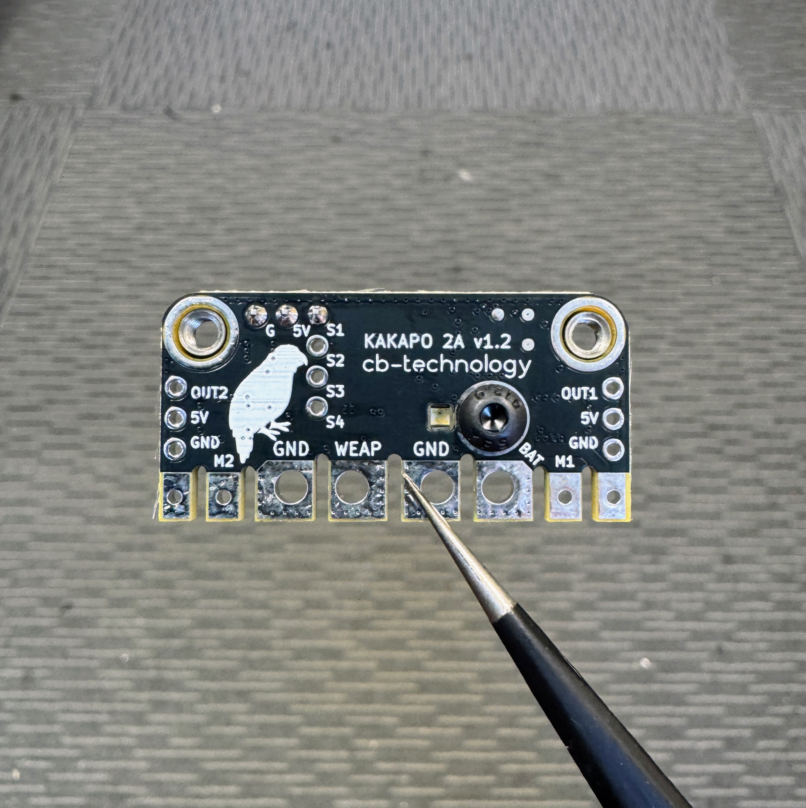

# KAKAPO - 2A v1.2

  

 

The KAKAPO is a compact, all-in-one control and power platform that's designed to be the heart of your robot, removing setup headaches so you can focus on building and battling. It builds on the proven WEKA dual DC motor architecture, now adding integrated power switching, distribution, and dedicated outputs for light-weight servos or ESCs; streamlining your electronics without compromise.

The product is named after the [Kākāpō](https://en.wikipedia.org/wiki/K%C4%81k%C4%81p%C5%8D), a nocturnal flightless parrot endemic to New Zealand.

Developed, assembled, and tested in [Christchurch, New Zealand](https://www.google.co.nz/maps/place/Christchurch+New+Zealand), by Connor Benton.

## FEATURES

- Dual Bi-Directional DC-motor outputs.
- Dual Servo/ESC signal outputs.
- High power input for XT30 connector or soldered wire.
- Anti-vibration power switch.
- Switched battery output for XT30 or soldered wire. 
- Power LED aligned with power switch access port.
- Status LED's to indicate run mode, fault and calibration.
- Under-voltage and over-temperature protections.
- Internal BEC to provide power for the radio and low-power auxilary circuits on the servo output connectors.
- Intelligent channel-wise failsafe behaviour.
- Simon-sais calibration process to customise drive modes, channel mapping, and channel inversion.
- Includes a 100nF capacitor across each motor output to filter noise and voltage spikes.
- Integrated M3 threads for mounting.

## SPECIFICATIONS

- **Dimensions:** 39x19x4mm *bare pin-header height* 
- **Weight:** 6g *excluding wires*
- **Voltage Input:** 6.0-26.1 (2-6S LiHV)
- **Motor Current Output - Continuious:** 2A  
- **Motor Current Output - Burst:** 3.6A
- **Radio Signal Input:** Servo PWM, CRSF
- **Servo/ESC Signal Output:** Servo PWM
- **BEC Output:** 5V, 1A. Designed to power your radio and low-power outputs on the servo connector
- **Power Switch Thread:** M3 (2mm Hex Key)
- **Mounting Thread:** M3

## USAGE
### Product Layout

### Product Mounting 

Mounting using the two provided M3 threaded bosses in each corner.

 

### Status LEDs

There are 3 LEDs on the KAKAPO (1x red, 2x blue). The red LED is in the center and a blue LEDs are on each edge beside the motor outputs.
 - **Normal Operation**
    - **No Power** Red: OFF, 2x Blue: OFF
    - **Standby** Red: ON, 2x Blue: OFF
    - **Driving** Red: ON, 2x Blue: ON. Each blue LED will illuminate when their corresponsing motor output is being driven.
 - **Fault Conditions**
    - **Signal-Input** Red: ON, 2x Blue: ALTERNATING FLASH (1Hz)
    - **Under-Voltage** Red: ON, 2x Blue: FLASH (1Hz)
    - **Over-Temperature** Red: ON, 2x Blue: FAST FLASH (5Hz)
 - **Calibration** Red: ON, 2x Blue: PATTERN. (See Calibration section for specific LED patterns)  

### Prototcol Auto-Detection

Each time the KAKAPO powers on, it attempts to identify the connected radio protocol. It first tries the last known protocol, then cycles through all supported protocols until a valid signal is found. Once detected, the protocol is saved and the system immediately enters normal operation. If no valid signal is detected, KAKAPO enters a signal-input fault state.

Note: Some receivers take a few seconds to link with the transmitter when powered on. In this case the KAKAPO will enter a signal-input fault state during this time. The fault state will clear automatically once the receiver connects and a valid signal is detected.

### Fault Conditions

KAKAPO continuously monitors for several fault conditions during operation. Each fault has a severity level, and if multiple faults occur at once, the most critical one takes control. Once resolved, the system steps down through the remaining faults until everything is cleared and normal operation resumes.

The monitored faults, listed from highest to lowest priority, are:

1. **Over-Temperature:** If an over-temperature condition occurs, all outputs shut down immediately and remain off until the temperature recovers to a safe level. KAKAPO includes multiple temperature sensors:
    - The primary sensor monitors the board temperature and triggers a fault at 100°C.
    - A backuop sensor in each motor driver that trips at 150°C.

2. **Under-Voltage:** An under-voltage faul is triggered if your battery voltage drops below 3.0V per cell. This is also a critical fault that causes immediate shutdown of all outputs until voltage recovers.

    Important note: When KAKAPO powers on, it automatically detects how many cells your battery has. It assumes the battery is mostly charged when doing this, so if you start up with a low battery, it might detect the wrong cell count and set the undervoltage threshold too low. To avoid issues, we recommend powering on with a fully-charged battery.

    | Battery Cells | Low Voltage   | High Voltage  | At Risk   | Percentage Overlap |
    | :---:         | :---:         | :---:         | :---:     | :---: |
    | 2s            | 6.0V          | 8.70V         | No        | n/a |
    | 3s            | 9.0V          | 13.05V        | No        | n/a |
    | 4s            | 12.0V         | 17.40V        | Yes       | 19.4% |
    | 5s            | 15.0V         | 21.75V        | Yes       | 35.6% |
    | 6s            | 18.0V         | 26.1V         | Yes       | 46.3% |

3. **Signal-Input:** KAKAPO uses an intelligent failsafe system that monitors each input channel individually. It only triggers a fault if a channel mapped to an output is lost. Here is how it works:
    1. Only mapped channels matter:
        - For example, if Channels 1, 2, and 3 are mapped to drive/servo outputs, but Channel 4 is unused, losing Channel 4 won’t trigger a fault.
    2. Faults are channel specific: 
        - If only the signal for one servo is lost, just that output stops, everything else keeps running.
        - In arcade drive mode, if the throttle channel is lost, the motors stop driving forward/backward, but turning and servos still work.
    3. The LED will show a signal-input fault whenever one or more mapped channels are lost.
    4. A channel must first be seen (with valid data) before it can be considered "lost":
        - For example, if a mapped channel was never connected at power on, it's not considered a fault. The fault only occurs if the channel was working and then disappears.

Note: You should still set the failsafe on the radio reciever to handle a loss of connection between the reciever and transmitter.

## CALIBRAITON

### Calibration Parameters

The KAKAPO has a number of parameters that are detected during the calibration process. These are:

- **Driving Mode:**
    - Tank (Each input channel controls a different motor)
    - Arcade (One input channel controls both motors speed and the second input controls steering) 
- **Motor Braking:**
    - When drive inputs are zero, you can choose if you want the wheels to coast or brake.
- **Input Mapping:**
    - Any input channel can control any output, with the following rules:
        - The two drive inputs cannot be the same channel
        - Neither drive input can map to the servo outputs
        - You can map a single input to both servo outputs 
- **Input Inversion:**
    - Any input channel can be reversed.
    - Eg: No resoldering the motor wires or reversing the control signal in radio.
- **Servo Output Enable:**
    - Either or both servo outputs can be enabled/disabled 

If at any point the calibration is corrupted, the KAKAPO will roll back to the factory settings:
- **Driving Mode:** Arcade
- **Motor Braking:** Enable
- **Motor A:**
    - Channel: Input 1
    - Reverse: False
- **Motor B:**
    - Channel: Input 2
    - Reverse: False
- **Servo Out1:**
    - Enabled: True
    - Channel: Input 3
    - Reverse: False
- **Servo Out2:**
    - Enabled: True
    - Channel: Input 4
    - Reverse: False

### Calibration Procedure

Please read this section in full before initiating calibration for the first time. The process moves quickly once started, but becomes intuitive after your first go.

Calibration settings are only saved once the entire procedure is completed. If you make a mistake, just power cycle the device and start again, nothing is saved until the end. 

1. Preparation
    - Install the motors in the orientation you want. This allows the system to correctly detect mapping and direction during calibration.
    - Connect the motors and radio receiver to the KAKAPO. Ensure the receiver is already bound to your transmitter.
    - Make sure the robot is elevated or safe to move. It will twitch and drive during calibration.

2. Entering Calibraiton Mode
    - Power on the KAKAPO.
    - Within 10 seconds, wiggle any connected input stick 20 times (must be wiggled to full forward and/or full reverse).
    - Calibration will only begin if at least two valid input channels are detected and the KAKAPO is not in a fault condition.
    - The two blue LEDs will pulse 10 times to indicate calibration mode has been entered.
    - The two blue LEDs will then stay solid on to wait for the user to start the calibratrion.

3. Drive Mode Detection.
    
    This "Simon-says" process detects drive mode (Tank or Arcade), input mapping, and input inversion by moving the motors and getting the user to input that back.     The user must then input that motion back into the remote. eg:
        - Robot twitches forward: Tank drive, simualtaneously push both sticks forward. Arcarde drive, push one stick forward.
        - Robot twitches left: Tank drive, simualtaneously push left stick back and right forward. Arade drive, push one stick left

    The simon-says process is:
    - The blue LEDs will still be solid from step 2, move any stick fully to MAX and back to CENTER to begin and both LED will turn off.
    - The motor movement tests has the process: 
        1. Both LEDs turn OFF.
        2. Motor twitch in a direction (eg fwd, rvs, left, right).
        3. One blue LED turns ON.
        4. Match that motion using your radio input (eg: robot moved fwd, push stick fwd)
        5. Second LED turns ON when valid input is seen
        6. Return stick(s) to center
        7. Both LEDs turn OFF and flash 3 times to confirm success
    - The process repeats for a second motion test.

4. Motor Braking Detection

    After drive inputs are confirmed, KAKAPO tests whether you want motor braking enabled when sticks return to zero.

    - Motors will briefly twitch, and one blue LED turns on
    - To enable braking, flick any input stick (doesn’t matter which) within 3 seconds.
        - The second LED will light up
        - Motors will twitch again
        - Both LEDs will pulse 3× to confirm braking is enabled
    - To disable braking, do nothing
        - Only one LED remains on
        - After timeout, both LEDs will pulse 3× and proceed

5. Servo Output Mapping

    If at least 3 valid channels are detected, KAKAPO proceeds to map the servo outputs. If only two channels are connected, this step is skipped.

    For each of the two servo outputs, you will:

    1. See one blue LED turn on
    2. Push the stick you want to assign (and the direction)
    3. When input is detected, second LED turns on
    4. Return stick to center
    5. Both LEDs will pulse 3× to confirm the mapping

    You can assign:
    - Both servos to the same input
    - Each servo to different inputs
    - Reverse one or both by pushing the stick in the opposite direction

 6. Calibration Complete
     - Both blue LEDs will pulse 10 times to indicate a successfull calibration.
     - Once the LED pulses are complete, the KAKAPO immediately enters Run mode using the new calibration.
     - If the KAKAPO is turned OFF before completing the calibration process, NONE of the new parameters are stored and it will revert to the previous configuraion. 

## COMMON QUESTIONS/ISSUES

1. The outputs are jerky. *Too big of a motor, or servo, battery voltage is too low, wire gague between battery and KAKAPO is tool small*
2. I cannot get into calibration mode.
3. The servo output is not generating a signal
4. The current protocol list is short. Are you adding more? Yes *(active development: PPM, SBUS, IBUS)* Future development:DShot (300/600), PWM, OneShot, Multishot
5. Id like to power a bigger servo from the output. *We are doing what we can to implement a larger 5V/8.4V regulator for the next version of the KAKAPO. We are up against size issues but are doing what we can*

## DISCLIAMER

This product, and all other cb-technology products, are intended for use in hobby projects, and for educational and experimental uses. These devices are not suitable for any application where human life or health or significant property value depend on their proper operation. cb-technology ltd are not responsible for any loss or damage incurred by the operation or failure of this product or any others. The specifications listed are accurate to the best of our knowledge but are not guaranteed in any way. The buyer assumes all responsibility for proper use, testing, and verification of this unit in any application. cb-technology ltd liability is limited to replacement of defective DOA units. By installing and using this unit you are agreeing to these terms. If you do not agree you may return any unused units for a refund.
